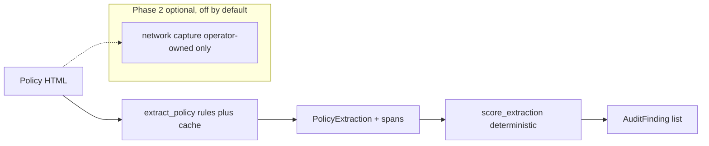

# neuroprivacy

Compliance auditing for consumer neural data devices. The tool extracts
typed, span-cited fields from public privacy policies and scores them with
deterministic rules against Colorado HB24-1058 and California SB 1223.

[](https://github.com/techiegoku2623/neuroprivacy/actions/workflows/ci.yml)
[](pyproject.toml)
[](LICENSE)

## Status

| Phase | Deliverable | Status |
| --- | --- | --- |
| 0 | Research memo and harnesses | In review — docs/phase-0/research-memo.md |
| 1 | Architecture, schemas, data contracts | Not started |
| 2 | First vertical slice | Not started |
| 3 | Evaluation and demo | Not started |

Status values: Not started / In progress / In review / Merged.

## The problem this solves

Colorado and California now treat neural data as sensitive personal
information. Vendor policies still talk past that category: some name it and
grant deletion, some bury it under "device data", and some grant deletion in
one paragraph and forbid it in the next. Hand review does not scale, and a
keyword scan misses the generic-cover case.

This is an observation tool. It is not a law firm, not a certification, and
not legal advice. Every response states that findings are observations.
Public policies only. No circumvention. Network observation, if it ever
runs, is optional, gated, and limited to operator-owned devices.

## Walkthrough

Phase 0 ships the designed sample set and the measurement harnesses. A full
`neuroprivacy audit` command is reserved for Phase 2; running it now is not
implemented on purpose.

### Step 1 — designed sample set

```bash
make setup && make demo
```

`make demo` calls `neuroprivacy demo-plan --dry-run`. Actual stdout:

```
neuroprivacy designed sample policies

vendor-a  vendor-a.html
  path:     explicit neural data + deletion right
  expected: Extractor cites neural-data and deletion spans. Status COMPLIANT.
  file:     data/sample/vendor-a.html

vendor-b  vendor-b.html
  path:     generic device data only
  expected: Keyword baseline names_neural_data=false and no generic cover. Rules extractor flags generic device data.
  file:     data/sample/vendor-b.html

vendor-c  vendor-c.html
  path:     deletion contradicted by retention
  expected: Status INDETERMINATE. Do not emit a single compliant/gap label.
  file:     data/sample/vendor-c.html

vendor-d  vendor-d-2025-01.html + vendor-d-2025-06.html
  path:     policy drift / clause removed
  expected: Diff reports discloses_sharing true→false. Monitoring cadence input.
  file:     data/sample/vendor-d-2025-01.html
  file:     data/sample/vendor-d-2025-06.html

Observations only. This output is not a legal conclusion, not legal advice, and not a compliance certification. Public policies only; no circumvention.
Network capture enabled: False (operator-owned devices only; off in Phase 0).

Dry run only. A full `neuroprivacy audit` CLI is Phase 2; this command exists so `make demo` can show that the sample set is designed, not scraped.
Sample directory: data/sample
```

The records are designed: a compliant naming, a keyword miss, a
contradiction, and a mid-year clause removal. See `data/sample/README.md`.

Recordings `demo/01-audit-vendor-a.cast` land in Phase 3.

### Step 2 — explicit neural data (Phase 2)

```bash
neuroprivacy audit data/sample/vendor-a.html
```

Reserved. Sample vendor-a. The span trail is the product, not a pass/fail badge.

### Step 3 — generic device data (Phase 2)

```bash
neuroprivacy audit data/sample/vendor-b.html
```

Reserved. Sample vendor-b. The keyword baseline misses this document. The
extractor must still cite "device data".

### Step 4 — contradiction (Phase 2)

```bash
neuroprivacy audit data/sample/vendor-c.html
```

Reserved. Sample vendor-c. The output must be INDETERMINATE. This is the
case a naive scanner gets confidently wrong.

### Step 5 — drift, then the measured baseline

```bash
neuroprivacy audit data/sample/vendor-d-2025-01.html data/sample/vendor-d-2025-06.html
make eval
```

`neuroprivacy audit` on vendor-d is reserved (diff of two snapshots).
`make eval` already runs: it regenerates `docs/EVALUATION.md` from the Phase
0 harnesses. The extractor column in Results is that output.

## Layout

Read in this order:

1. `docs/phase-0/research-memo.md` — why the defaults and the failure condition
2. `data/sample/README.md` — why each demo policy exists
3. `src/neuroprivacy/extractor.py` — span extractor and keyword baseline
4. `src/neuroprivacy/statutes.py` — encoded CO/CA clauses
5. `research/phase0/` — the three measurements behind the memo
6. `src/neuroprivacy/cli.py` — demo-plan only, until Phase 2

## Results

Regenerated by `make eval`. Baseline column is mandatory.

<!-- EVAL_TABLE_BEGIN -->

| System | Metric | n | Notes |
| --- | --- | --- | --- |
| Rules+cache extractor (Phase 0) | mean field F1 1.000 | 20 | vs hand labels; κ vs keyword 0.722 |
| Keyword baseline | κ vs extractor 0.722 | 20 | Misses generic device-data cover (5/5) |
| Statute coverage | policy-text 0.636 | 22 | CO HB24-1058 + CA SB 1223 encoded clauses |
| Policy drift | change rate 0.291 | 60 | cadence monthly |
| Live public-policy hold-out | Phase 3 | — | Must beat Phase 0 mean F1 |

<!-- EVAL_TABLE_END -->

## 🏗️ Architecture & Event Topology



`ExtractedField.span` is the data that moves. `AuditFinding.status` is
`INDETERMINATE` when deletion and retention contradict. Network capture is
not on this path.

## ⚖️ Architecture Trade-offs & Pragmatic Decisions

| Chosen | Given up | What would change the answer |
| --- | --- | --- |
| Deterministic span rules + committed LLM cache | Live LLM in Phase 0 | extraction_accuracy F1 on a live hold-out beating rules |
| Statutory scoring as rules | LLM-as-judge | A labeled rubric where the judge beats rules without flipping INDETERMINATE |
| Policy text first, capture gated | Always-on intercept | statute_coverage showing policy text cannot decide the product |
| Synthetic Wayback snapshots | Live scrapes | A robots-honoring public crawl with a change-rate that disagrees |
| Observations, not conclusions | Certification language | Nothing. This is non-negotiable. |

## 🛡️ Edge Cases & Failure Modes

- Generic "device data" with no neural/brain/EEG tokens: keyword baseline is
  a miss; rules extractor must still fire `covers_generic_device_data`.
- Deletion plus "cannot delete" / long retention: status is INDETERMINATE,
  not GAP and not COMPLIANT.
- "We do not sell" still contains the sale token. The field is about
  disclosure of the topic, not about the vendor's claimed posture.
- Access and correction rights are policy-text-checkable in principle but
  have no Phase 0 schema field. They are unmeasured.
- Network capture without operator opt-in must refuse. Default is off.
- Live vendor HTML, JavaScript-rendered policies, and authenticated portals
  are out of scope. Fetching them is unmeasured.

## Limitations

This is not a legal opinion. Phase 0 extracts designed fixtures, not the
live web. Statute objects are public-text summaries and can drift from
session law. No demo recording is committed. No live model is called.

## License and citation

MIT. Cite Colorado HB24-1058 (amending C.R.S. § 6-1-1303 et seq.) and
California SB 1223 (amending Cal. Civ. Code § 1798.140) for the statutory
categories, and this repository for the extractor. Findings remain
observations.
