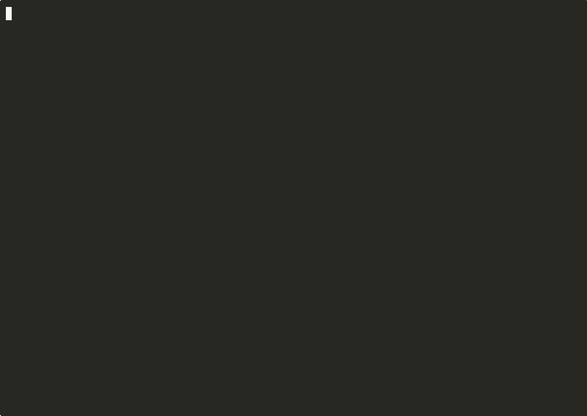
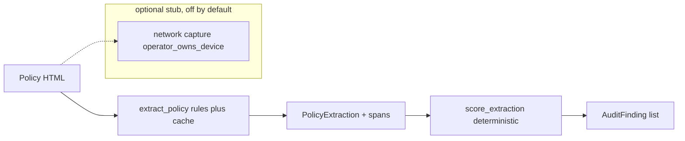

# neuroprivacy

Compliance auditing for consumer neural data devices. The tool extracts
typed, span-cited fields from public privacy policies and scores them with
deterministic rules against Colorado HB24-1058 and California SB 1223.

[](https://github.com/techiegoku2623/neuroprivacy/actions/workflows/ci.yml)
[](pyproject.toml)
[](LICENSE)




Regenerable terminal video: `make record`. [Full mp4](demo/out/neuroprivacy-demo.mp4). Per-shot loops live in `demo/out/`. See `demo/README.md`.

## Status

| Phase | Deliverable | Status |
| --- | --- | --- |
| 0 | Research memo and harnesses | Phase 0–3 Merged |
| 1 | Architecture, schemas, data contracts | Phase 0–3 Merged |
| 2 | First vertical slice | Phase 0–3 Merged |
| 3 | Evaluation and demo | Phase 0–3 Merged |

Status values: Not started / In progress / In review / Merged.

## The problem this solves

Colorado and California now treat neural data as sensitive personal
information. Vendor policies still talk past that category: some name it and
grant deletion, some bury it under "device data", and some grant deletion in
one paragraph and forbid it in the next. Hand review does not scale, and a
keyword scan misses the generic-cover case.

This is an observation tool. It is not a law firm, not a certification, and
not legal advice. Every response states that findings are observations.
Public policies only. No circumvention. Network observation, if it ever
runs, is optional, gated, and limited to operator-owned devices.

## Walkthrough

`make demo` is the full walkthrough. No credentials. Under five minutes.
It runs extract, audit (keyword miss + conflicts), dated diff, and the
static HTML report from committed fixtures.

### Step 1 — extract with spans

```bash
make setup && neuroprivacy extract --doc data/sample/vendor-a.html
```

Actual stdout:

```
neuroprivacy extract
doc: /agent/repos/neuroprivacy/data/sample/vendor-a.html
LLM: committed cache only (no live model). Span-level citation is mandatory.
                      Structured fields — vendor-a (cache)
┏━━━━━━━━━━━━━━━━━━━━━━━━━┳━━━━━━━┳━━━━━━━━┳━━━━━━━━━━━━━━━━━━━━━━━━━┳━━━━━━━━━┓
┃ field                   ┃ value ┃ source ┃ span text               ┃ offsets ┃
┡━━━━━━━━━━━━━━━━━━━━━━━━━╇━━━━━━━╇━━━━━━━━╇━━━━━━━━━━━━━━━━━━━━━━━━━╇━━━━━━━━━┩
│ covers_generic_device_… │ false │ cache  │ —                       │ —       │
│ discloses_sale          │ true  │ cache  │ sell                    │ 515:519 │
│ discloses_sharing       │ false │ cache  │ —                       │ —       │
│ grants_deletion         │ true  │ cache  │ right to delete         │ 254:269 │
│ names_neural_data       │ true  │ cache  │ neural data             │ 170:181 │
│ retention_conflicts_de… │ false │ cache  │ —                       │ —       │
│ states_consent_for_sen… │ true  │ cache  │ consent                 │ 335:342 │
│ states_purpose_limitat… │ true  │ cache  │ only for the specified  │ 404:434 │
│                         │       │        │ purpose                 │         │
└─────────────────────────┴───────┴────────┴─────────────────────────┴─────────┘
document status: COMPLIANT
  observation: Neural data is named and a deletion right is stated.
prompt_hash: 3f997be6171ebde525b5a5f980a3ddf2df53f5669c9b8732f4d776ff04b277ea
span-level citation: every true field has character offsets.
Observations only. This output is not a legal conclusion, not legal advice, and
not a compliance certification. Public policies only; no circumvention.
```

LLM extraction uses the committed cache only. Every true field carries a
source span and character offsets.

### Step 2 — audit vendor-b (keyword baseline finds nothing)

```bash
neuroprivacy audit --vendor vendor-b
```

Actual stdout (keyword comparison and fields; the CO/CA scorecard follows
in the same command):

```
neuroprivacy audit
vendor: vendor-b  file: vendor-b.html  dated: 2024-06-01
extractor status: COMPLIANT  source: cache
Keyword baseline comparison
  names_neural_data=false  covers_generic_device_data=false
  baseline finds nothing: no neural/brain/EEG token and no generic-cover rule.
  rules extractor names_neural_data=false  covers_generic_device_data=true
                     Structured fields — vendor-b (cache)
┏━━━━━━━━━━━━━━━━━━━━━━━━━━━━━━┳━━━━━━━┳━━━━━━━━┳━━━━━━━━━━━━━━━━━━━┳━━━━━━━━━┓
┃ field                        ┃ value ┃ source ┃ span text         ┃ offsets ┃
┡━━━━━━━━━━━━━━━━━━━━━━━━━━━━━━╇━━━━━━━╇━━━━━━━━╇━━━━━━━━━━━━━━━━━━━╇━━━━━━━━━┩
│ covers_generic_device_data   │ true  │ cache  │ device data       │ 180:191 │
│ discloses_sale               │ false │ cache  │ —                 │ —       │
│ discloses_sharing            │ true  │ cache  │ service providers │ 347:364 │
│ grants_deletion              │ true  │ cache  │ right to delete   │ 281:296 │
│ names_neural_data            │ false │ cache  │ —                 │ —       │
│ retention_conflicts_deletion │ false │ cache  │ —                 │ —       │
│ states_consent_for_sensitive │ false │ cache  │ —                 │ —       │
│ states_purpose_limitation    │ false │ cache  │ —                 │ —       │
└──────────────────────────────┴───────┴────────┴───────────────────┴─────────┘
document status: COMPLIANT
  observation: Coverage is only under a generic device-data category.
```

The keyword baseline finds nothing for neural data. The rules extractor
still cites `device data` at `[180:191]` and scores CO/CA clauses.

### Step 3 — conflicting spans (INDETERMINATE)

```bash
neuroprivacy audit --vendor vendor-c --show-conflicts
```

Actual stdout (conflict block):

```
Conflicting spans
  1. grants_deletion: "right to delete" [221:236]
  2. retention_conflicts_deletion: "cannot delete" [333:346]
  CO-DELETE status: INDETERMINATE
  observation: Deletion is stated and contradicted by retention. INDETERMINATE.
Observations only. This output is not a legal conclusion, not legal advice, and
not a compliance certification. Public policies only; no circumvention.
```

Two spans. The deletion clause is INDETERMINATE. This is not a legal
conclusion.

### Step 4 — dated drift, then the HTML report

```bash
neuroprivacy diff --vendor vendor-d --since 2025-01-01
make report
```

Actual stdout:

```
neuroprivacy diff
vendor: vendor-d  since: 2025-01-01
  2025-01-15  vendor-d-2025-01.html
  2025-06-15  vendor-d-2025-06.html
                          Removed or changed clauses
┏━━━━━━━━━━━━━━━━━━━┳━━━━━━━━━━━━━━━━━━━┳━━━━━━━━━━━━━━━━━━━━┳━━━━━━━━━━━━━━━━┓
┃ field             ┃ before            ┃ after              ┃ change         ┃
┡━━━━━━━━━━━━━━━━━━━╇━━━━━━━━━━━━━━━━━━━╇━━━━━━━━━━━━━━━━━━━━╇━━━━━━━━━━━━━━━━┩
│ discloses_sharing │ true (2025-01-15) │ false (2025-06-15) │ removed clause │
└───────────────────┴───────────────────┴────────────────────┴────────────────┘
Observations only. This output is not a legal conclusion, not legal advice, and
not a compliance certification. Public policies only; no circumvention.
```

```
wrote docs/report/index.html
Observations only. This output is not a legal conclusion, not legal advice, and
not a compliance certification. Public policies only; no circumvention.
```

`make eval` still regenerates `docs/EVALUATION.md` from the Phase 0
harnesses. Recordings: `demo/01-extract-with-spans.cast`,
`demo/02-audit-and-conflicts.cast`, `demo/03-drift-and-report.cast`.

## Network capture (stub)

The capture module is a stub. It refuses unless `operator_owns_device=true`
(env `NEUROPRIVACY_OPERATOR_OWNS_DEVICE=1`) **and**
`NEUROPRIVACY_NETWORK_CAPTURE=1`. Default:

```
neuroprivacy capture stub
enabled=False  operator_owns_device=False
Network capture refused: operator_owns_device is not true. This stub never
observes a device the operator does not own. No authenticated scrape. No reverse
engineering.
```

No scraping behind authentication. No reverse engineering. Public policies
only.

## Layout

Read in this order:

1. `docs/phase-0/research-memo.md` — why the defaults and the failure condition
2. `data/sample/README.md` — why each demo policy exists
3. `src/neuroprivacy/extractor.py` — span extractor and keyword baseline
4. `src/neuroprivacy/statutes.py` — encoded CO/CA clauses
5. `src/neuroprivacy/scoring.py` — deterministic statutory scoring
6. `src/neuroprivacy/capture.py` — gated network-capture stub
7. `research/phase0/` — the three measurements behind the memo
8. `src/neuroprivacy/cli.py` — extract / audit / diff / report
9. `docs/report/index.html` — static scorecard from committed samples

## Results

Regenerated by `make eval`. Baseline column is mandatory.

<!-- EVAL_TABLE_BEGIN -->

| System | Metric | n | Notes |
| --- | --- | --- | --- |
| Rules+cache extractor (Phase 0) | mean field F1 1.000 | 20 | vs hand labels; κ vs keyword 0.722 |
| Keyword baseline | κ vs extractor 0.722 | 20 | Misses generic device-data cover (5/5) |
| Statute coverage | policy-text 0.636 | 22 | CO HB24-1058 + CA SB 1223 encoded clauses |
| Policy drift | change rate 0.291 | 60 | cadence monthly |
| Live public-policy hold-out | Phase 3 | — | Must beat Phase 0 mean F1 |

<!-- EVAL_TABLE_END -->

## 🏗️ Architecture & Event Topology



`ExtractedField.span` is the data that moves. `AuditFinding.status` is
`INDETERMINATE` when deletion and retention contradict. Network capture is
not on this path.

## ⚖️ Architecture Trade-offs & Pragmatic Decisions

| Chosen | Given up | What would change the answer |
| --- | --- | --- |
| Deterministic span rules + committed LLM cache | Live LLM | extraction_accuracy F1 on a live hold-out beating rules |
| Statutory scoring as rules | LLM-as-judge | A labeled rubric where the judge beats rules without flipping INDETERMINATE |
| Policy text first, capture gated | Always-on intercept | statute_coverage showing policy text cannot decide the product |
| Synthetic Wayback snapshots | Live scrapes | A robots-honoring public crawl with a change-rate that disagrees |
| Observations, not conclusions | Certification language | Nothing. This is non-negotiable. |

## 🛡️ Edge Cases & Failure Modes

- Generic "device data" with no neural/brain/EEG tokens: keyword baseline is
  a miss; rules extractor must still fire `covers_generic_device_data`.
- Deletion plus "cannot delete" / long retention: status is INDETERMINATE,
  not GAP and not COMPLIANT.
- "We do not sell" still contains the sale token. The field is about
  disclosure of the topic, not about the vendor's claimed posture.
- Access and correction rights are policy-text-checkable in principle but
  have no schema field. They are unmeasured.
- Network capture without `operator_owns_device=true` must refuse.
- Live vendor HTML, JavaScript-rendered policies, and authenticated portals
  are out of scope. Fetching them is unmeasured.

## Limitations

This is not a legal opinion. The extractor reads designed fixtures and the
committed cache, not the live web. Statute objects are public-text summaries
and can drift from session law. Findings remain observations.

## License and citation

MIT. Cite Colorado HB24-1058 (amending C.R.S. § 6-1-1303 et seq.) and
California SB 1223 (amending Cal. Civ. Code § 1798.140) for the statutory
categories, and this repository for the extractor. Findings remain
observations.
